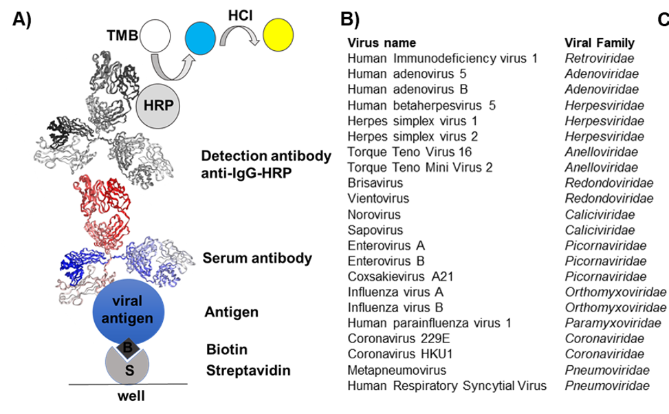
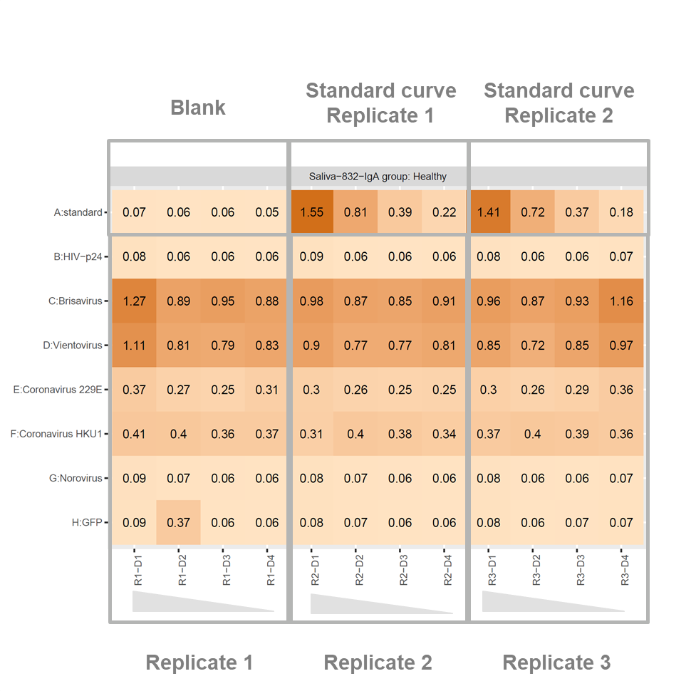

# modELISA-S
Screening for viral antibodies in saliva samples, using a modified ELISA with viral antigens

1. Run spli_tables2.sh 
2. Run Combine_Tables.R

## Experimental setup

Modified ELISA to detect antobodies that bind to viral antigens. 

A) Experimental setup

B) Available viral antigens

## Plates setup 

This modular design allows to test several antigens in a single plate.

A1:A4 Blank

A5:A8 Standard curve, replicate 1

A9:A12 Standard curve, replicate 2

B to H, 1:4 Replicate 1

B to H, 5:8 Replicate 2

B to H, 9:12 Replicate 3

